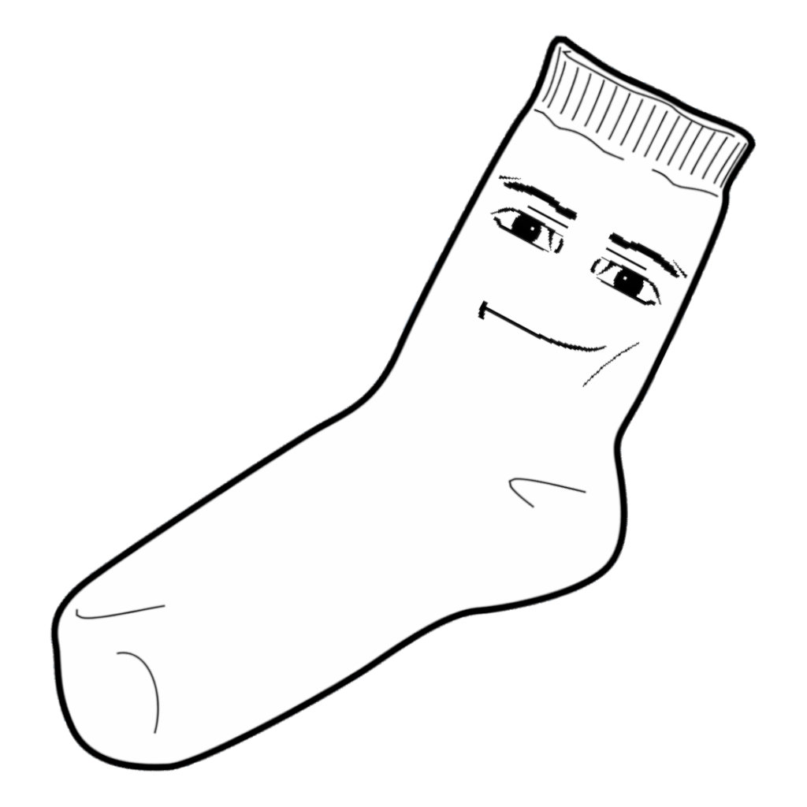

<div align="center">

# ManSock

[](https://github.com/notwithering/mansock/blob/main/LICENSE)
[](https://goreportcard.com/report/github.com/notwithering/mansock)


</div>

**ManSock** is a simple CLI program used to debug tcp/udp servers with an interactive command-line

This program was inspired by GameMaker 8.2 sockets, which is why the commands are so similar.

## Installing

```bash
go install github.com/notwithering/mansock@latest
```

## Example

```ruby
$ ./udpserver &

$ mansock
MANSOCK> set PORT string "42480"
MANSOCK> set PROTO string "udp"
MANSOCK> wb string "Hello, world!"
MANSOCK> c
MANSOCK> ws

UDP Server: "Hello, world!"
```

## What does ManSock mean?

Despite the funny name, it actually stands for something

**Man**ual **Sock**et
